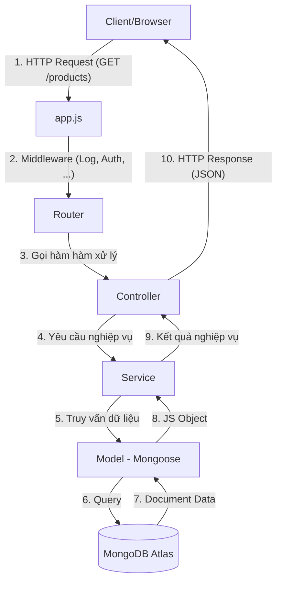

# 🗺️ Sơ đồ luồng chạy dự án (Request Lifecycle)

Dưới đây là sơ đồ mô tả hành trình của một yêu cầu (Request) từ khi khách hàng nhấn vào đường link cho đến khi nhận được dữ liệu từ Database.

---

## 🔍 Giải thích chi tiết từng bước:

### 1. **Client (Trình duyệt/Postman)**
Người dùng gửi một yêu cầu, ví dụ: `GET http://localhost:3000/products`.

### 2. **Entry Point (app.js)**
Nơi khởi tạo Server. Request sẽ đi qua các **Middleware** (như log thời gian truy cập) trước khi đến các bộ định tuyến.

### 3. **Routing (app.js)**
Express kiểm tra URL và Method để quyết định xem "ai" sẽ xử lý yêu cầu này.
*Ví dụ: `app.get('/products', productController.getAll)`.*

### 4. **Controller (Lớp điều khiển)**
Đóng vai trò "người tiếp tân".
- Nhận input từ request (`params`, `query`, `body`).
- Gọi Service tương ứng để xử lý.
- Trả về response (`res.json()`, `res.status()`).
- **Nhiệm vụ chính:** Quản lý giao tiếp với Client.

### 5. **Service (Lớp nghiệp vụ)**
Đóng vai trò "nhà bếp/xử lý".
- Thực hiện các logic tính toán, lọc dữ liệu, hoặc kiểm tra quyền.
- Gọi Model để tương tác với Database.
- **Nhiệm vụ chính:** Giải quyết bài toán nghiệp vụ (Business Logic).

### 6. **Model (Lớp dữ liệu)**
Đóng vai trò "thủ kho".
- Sử dụng Mongoose để định nghĩa cấu trúc dữ liệu (Schema).
- Thực hiện CRUD (Create, Read, Update, Delete) xuống Database.
- **Nhiệm vụ chính:** Quản lý dữ liệu.

### 7. **MongoDB Atlas**
Nơi lưu trữ dữ liệu thực tế dưới dạng các Document (JSON).

---

> [!TIP]
> **Tại sao phải chia 3 lớp (Controller - Service - Model)?**
> - **Dễ bảo trì:** Muốn thay đổi cách lưu dữ liệu? Chỉ cần sửa Model. Muốn thay đổi logic giảm giá? Chỉ cần sửa Service.
> - **Dễ kiểm thử:** Có thể test logic ở Service mà không cần chạy Server hay Browser.
> - **Code sạch:** Mỗi file chỉ làm một nhiệm vụ duy nhất (Single Responsibility Principle).
